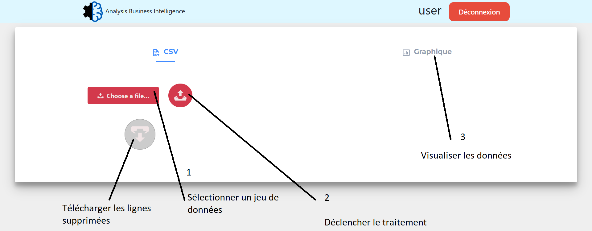

# Contexte

Développeur chez **Analysis Features Preprocessing And Research**, une ESN spécialisée dans la réalisation d’applicatifs de type BI et intelligence artificielle. On m'a confié la tâche de réaliser un proof of concept (PoC) dans le cadre d’un projet de dashboard d’aide à la décision pour un client exigeant. J'ai accès à un fichier de données brutes, matérialisant un export depuis leurs bases de données opérationnelles. Ce fichier CSV alimentera la base analytique et tient lieu de situation initiale. Les CSV des mois suivants vous seront régulièrement transmis.

# Documentation
https://tangible-slug-162.notion.site/Documentation-Projet-1C-0f26194361574ebf9d1c15e5553390b5?pvs=4

# Installation en local
 
```
git clone -b demo https://github.com/DevIA05/1C.git
cd 1C
python -m virtualenv .venv
.venv/Script/activate 
pip install -r requirements.txt
python src/manage.py runserver
```

# Jeu de données
Un jeu de données d'exemple se trouve dans **ressource/data/data_demo.csv**. 

# Application
Après s'être connecté:

